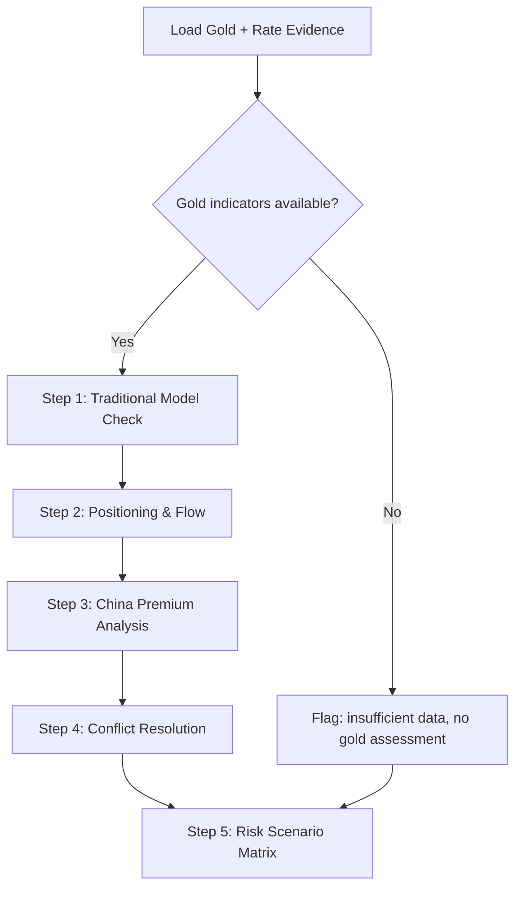

# Blueprint: Gold / Rate Conflict Resolution

**ID**: gold-rate-conflict
**Version**: 1.0.0
**Triggers**: every run (gold is a core holding in this portfolio)
**Input**: evidence-packet.json (gold indicators + rate indicators + CFTC positioning)
**Output**: gold valuation assessment with confidence

## Role

You are a CFA charterholder analyzing the apparent contradiction between elevated real rates (bearish for gold) and gold prices near all-time highs (bullish). Your job is to resolve this conflict through structured multi-factor analysis, not to pick a side.

## Reasoning Flow



## Step-by-Step

### Step 1: Traditional Model Check

Gold's traditional pricing model: Gold ↑ when real rates ↓, USD ↓.

Examine:
- **B8 (10Y TIPS real yield)**: the primary gold driver — higher real rates = bearish for gold
- **X1 (DXY)**: secondary driver — stronger dollar = bearish for gold
- **G4 (COMEX gold)**: actual price
- **衍生: G10 金银比**: sentiment check
- **衍生: G9 金油比**: inflation hedge demand

Key question: Are real rates and USD aligned with gold price direction?

```
analysis_fields:
  - tips_real_yield_pct: {B8.value}
  - dxy_level: {X1.value}
  - comex_gold_usd: {G4.value}
  - model_implied_direction: [bullish / bearish / neutral]
  - actual_direction: [bullish / bearish]
  - conflict_detected: [YES if model ≠ actual / NO if aligned]
```

### Step 2: Positioning & Flow Analysis

Examine:
- **G8l (CFTC long)**, **G8s (CFTC short)**: speculative positioning
- **G7 (SPDR holdings)**: ETF flow
- **G6 (央行黄金储备)**: central bank buying

Key question: Is gold being driven by speculative positioning (fragile) or structural flows (durable)?

```
analysis_fields:
  - cftc_long_short_ratio: {G8l.value}:{G8s.value}
  - cftc_positioning: [crowded / normal / light]
  - spdr_holdings: {G7.value}
  - spdr_trend: [inflows / outflows / stable]
  - cb_reserves: {G6.value}
  - cb_trend: [accumulating / reducing / stable]
  - primary_driver: [speculation / structural demand / both]
  - gold_bid_quality: [fragile — vulnerable to liquidation / durable — supported by long-term flows]
```

### Step 3: China Premium Analysis

Examine:
- **G2 (Au99.99)**: Shanghai gold price
- **衍生: G11 国内溢价**: Shanghai vs COMEX discount/premium
- **X3 (USD/CNY)**: RMB exchange rate

Key question: Is there a China-driven dislocation in gold pricing?

### Step 4: Conflict Resolution

Resolve the core conflict using a weighted framework:

| Factor | Weight | Signal | Score (-2 to +2) |
|--------|--------|--------|-------------------|
| Real Rates (TIPS) | 35% | {value} | {score} |
| USD (DXY) | 20% | {value} | {score} |
| Positioning (CFTC) | 20% | {ratio}:1 | {score} |
| Structural Flow (SPDR + CB) | 15% | {status} | {score} |
| China Premium | 10% | {premium}% | {score} |
| **Weighted Score** | | | **{total}** |

Score interpretation:
- +1.0 to +2.0: Strongly bullish for gold
- +0.3 to +0.9: Moderately bullish
- -0.3 to +0.3: Neutral / conflicting
- -0.3 to -0.9: Moderately bearish
- -1.0 to -2.0: Strongly bearish

### Step 5: Risk Scenario Matrix

| Scenario | Trigger | Probability | Gold Impact | Portfolio Implication |
|----------|---------|------------|-------------|----------------------|
| Soft landing | TIPS < 1.8%, FOMC cuts | ? | Bullish | Add to gold position |
| Reflation | Breakeven > 2.5%, PCE re-accelerates | ? | Bullish | Hold gold as inflation hedge |
| Hard landing | SOFR spikes, credit spreads blow out | ? | Initially bearish, then bullish | Reduce first, buy dip |
| USD regime shift | DXY breaks below 98 | ? | Very bullish | Add to gold + non-USD assets |
| Positioning flush | CFTC ratio normalizes to <3:1 | ? | Bearish (-5 to -10%) | Trim if over-allocated |

## Output Schema

```json
{
  "claim": "Gold medium-term support intact despite real rate headwind",
  "confidence": "medium",
  "model_conflict": {
    "traditional_model_signal": "bearish",
    "actual_price_signal": "bullish",
    "conflict_resolution": "Structural flows (central bank + SPDR) and policy uncertainty premium offset real rate pressure. CFTC positioning is crowded (8.3:1) — short-term correction risk exists."
  },
  "weighted_score": {
    "total": 0.4,
    "interpretation": "Moderately bullish, but fragile due to crowded positioning"
  },
  "supporting_evidence": [
    {"indicator": "G4", "value": "$4200", "signal": "Price at all-time highs"},
    {"indicator": "G7", "value": "32.3M oz", "signal": "SPDR holdings elevated"},
    {"indicator": "G6", "value": "7496 万盎司", "signal": "PBOC continues accumulation"}
  ],
  "opposing_evidence": [
    {"indicator": "B8", "value": "2.16%", "signal": "10Y TIPS at restrictive level — bearish for gold"},
    {"indicator": "G8l/G8s", "value": "8.3:1", "signal": "CFTC positioning extremely crowded — correction risk"}
  ],
  "stale_or_missing_data": [],
  "invalidate_if": [
    "If TIPS re-breaks above 2.5% → gold traditional model pressure resumes, reduce conviction",
    "If CFTC ratio drops below 3:1 → positioning flush complete, re-evaluate entry",
    "If DXY breaks above 104 → USD strength may overwhelm gold structural bid"
  ],
  "action_gate": {
    "action_allowed": false,
    "action_reason": "Gold signals are conflicting: structural support vs crowded positioning. Hold current position, do not add."
  },
  "scenarios": [
    {"scenario": "Soft landing", "trigger": "TIPS < 1.8%, FOMC cuts", "probability": "medium", "gold_impact": "bullish"},
    {"scenario": "Positioning flush", "trigger": "CFTC normalizes to <3:1", "probability": "medium-high", "gold_impact": "bearish short-term"}
  ]
}
```

## Guard

- Do NOT use gold price from news articles — only from evidence packet indicators.
- Do NOT conflate Shanghai gold price (G2) with COMEX (G4) — always specify which market.
- The G11 domestic discount must be calculated from same-day prices, not mixed dates.
- If G4 (COMEX) is staleGap, flag gold assessment confidence as Low.
